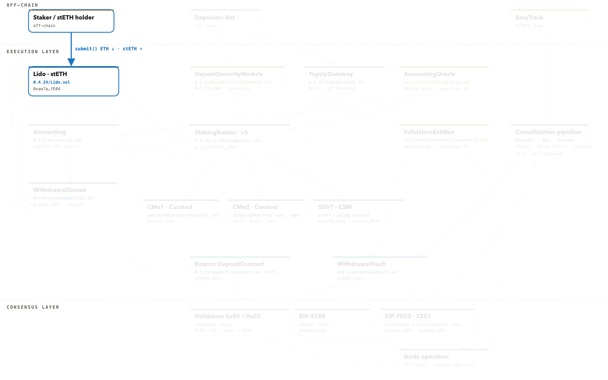
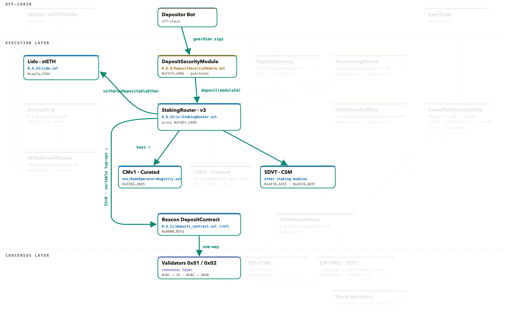
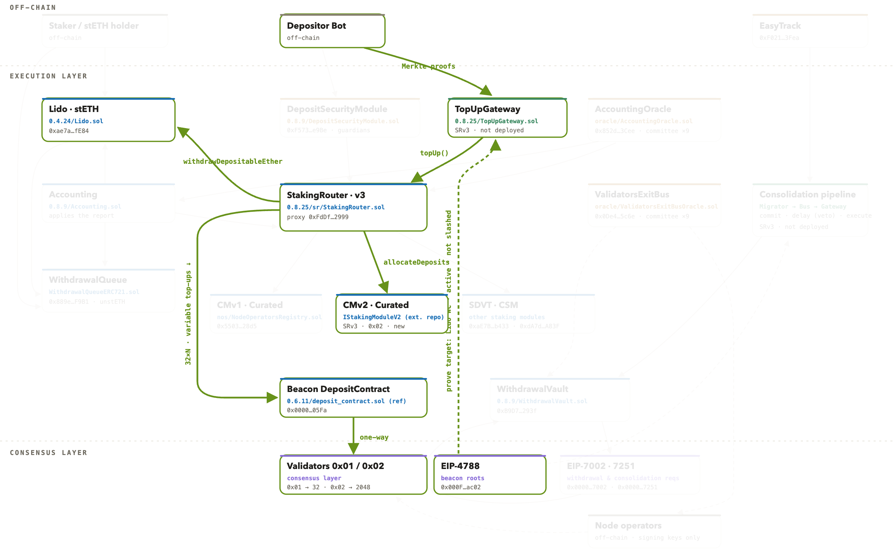
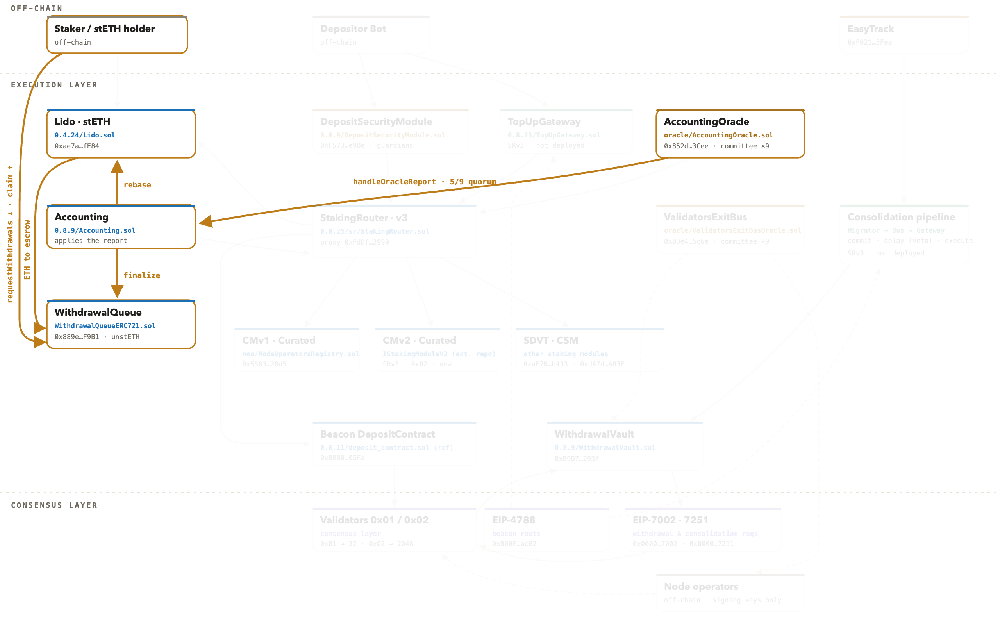
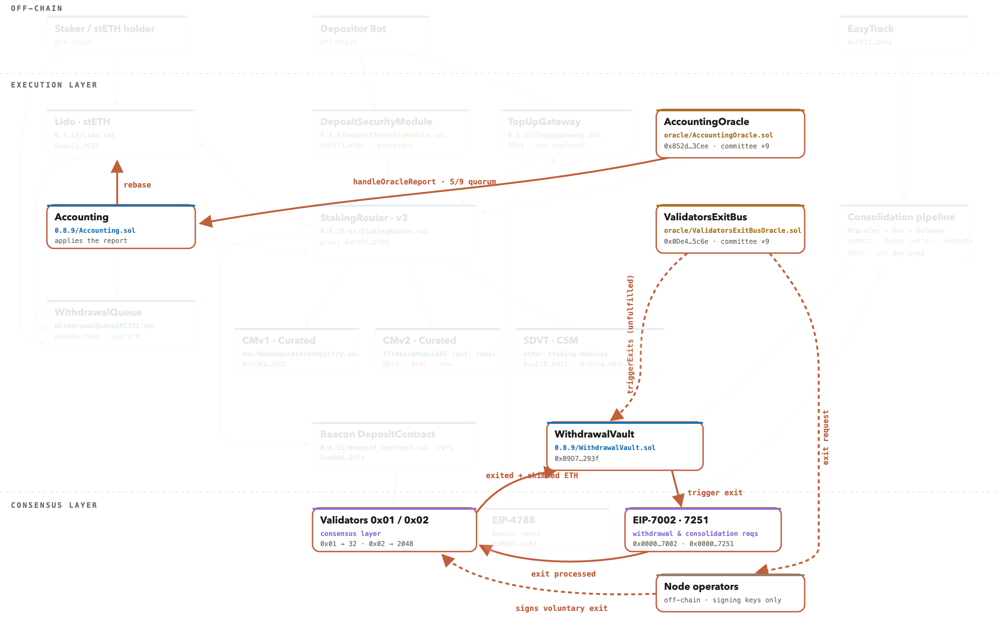
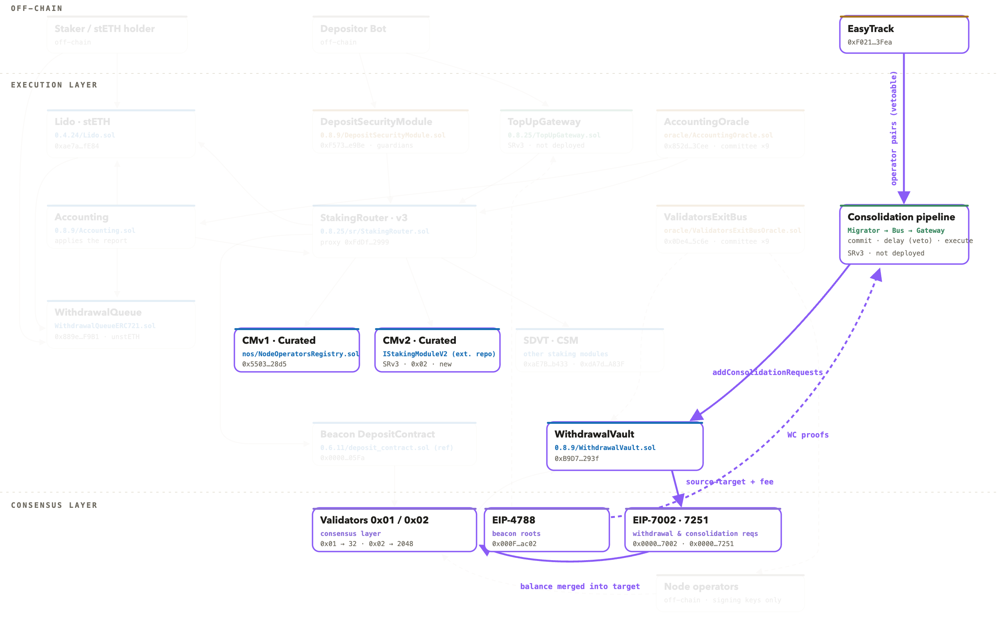
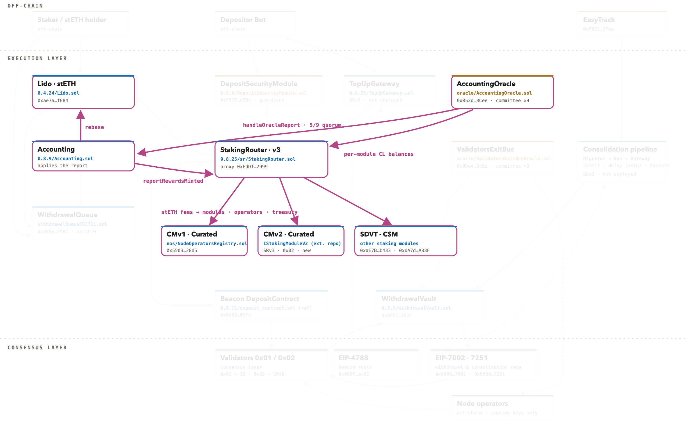
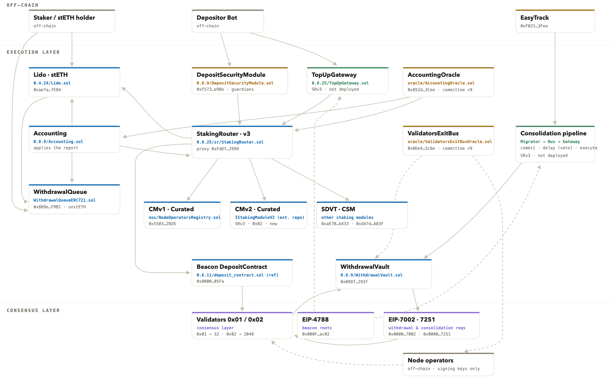

# SRv3 assumption map, by protocol flow

## Introduction

PR 1811 introduces Staking Router v3, upgrading Lido for EIP-7251 (MaxEB). It
replaces validator-count accounting with module-balance accounting and
introduces pull-based deposits, deposit reserves, 0x02 validator top-ups,
consolidation, and balance-aware exits.

Some guarantees previously machine checked by Certora do not carry over to
SRv3. We used two baselines:

- The **April 2023 Lido V2 report** (Certora), which directly verified the
  previous StakingRouter and is the primary baseline.
- The **December 2025 Lido V3 report** (Certora), which provides a secondary
  system-level baseline but abstracted key router operations
  (`StakingRouter.deposit()` and `reportRewardsMinted()` summarized as NONDET)
  and assumed at most two modules with constant parameters.

And mapped those guarantees to the SRv3 snapshot at commit
`af095e48bbc1c3841c2c9936219c8461af01056b` (July 1 2026), identifying **what
remains applicable, what depends on assumptions, what no longer carries over,
and what should be verified next**. We then used the findings from the July
2026 SRv3 security reviews (Certora, Statemind, MixBytes) to help prioritize
what deserves verification first.

Baseline rule names below are quoted verbatim from the two Certora reports
(V2: per-contract property lists, pp. 21-28; V3: property IDs `P-XX-NN` with
per-rule names). A checkmark is the status in the *original* report; a cross
means the rule was violated there (with the associated finding ID).

## How to read this map

The map is organized in 7 protocol flows plus one extra category for
invariants that guard several flows at once:

1. (**SAME**) Stake: When a user mints stETH by depositing ETH into the contract.
2. (**CHANGED**) Validator creation: Triggered by the depositor bot, this moves
   32 ETH from Lido contracts to the consensus layer (so these ethers
   effectively become "productive"), staked to a new validator.
3. (**NEW**) Top up: A new flow, also triggered by the depositor bot, moving a
   variable amount of ETH to the consensus layer, staked to an existing
   validator (see EIP-7251).
4. (**CHANGED**) Withdrawal: When a user redeems stETH for the underlying ETH.
5. (**CHANGED**) Validator exit: When a validator fully exits the consensus
   layer and the staked ETH move back to Lido contracts. Usually triggered by
   the oracle committee or the DAO, but can also happen from the operator
   itself.
6. (**NEW**) Consolidation: When migrating stakes from CMv1 modules to 0x02
   validators from CMv2 modules without an exit/re-deposit cycle (moving ETH on
   the consensus layer).
7. (**CHANGED**) Oracle reporting: When the Oracle committee reports data daily
   about the consensus layer to Lido contracts on the execution layer.
8. (**CHANGED**) Cross-cutting: Invariants that do not belong to a single flow
   but gate several of them at once: module registry and lifecycle statuses,
   role configuration, the one-shot v2 to v3 storage migration, and the
   rewritten report sanity checker.

For each flow we state what SRv3 changes, show the flow on the component map
(renders from [`diagram/`](../../diagram/), interactive version
[here](https://claude.ai/code/artifact/18b32b1e-d8ab-4d38-86b9-5de8552ffcfe)),
list the machine-checked baseline anchors, then four coverage statuses against
those baselines.

## Cross-reference index

Use this table to jump from a flow to the exact baseline rules it inherits
from, the Lean targets that cover it today, and the next verification target.
It is the map's index: each cell is expanded in the flow sections below.

| # | Flow | SRv3 | Key Certora anchors (V2 04-2023 / V3 12-2025) | Lean targets today | Verify next |
| --- | --- | --- | --- | --- | --- |
| 1 | Stake & buffer | Changed: reserve split, pull model | `integrityOfSubmit`, `BufferedEthIsAtMostLidoBalance` / `P-LI-01..04, 08` | SRV3-P1 (reserve boundary) | Reserve invariants as theorems |
| 2 | Validator creation | Changed: router pulls 32×N, no caller count | `integrityOfDeposit`, `afterDepositSummaryIsUpdatedCorrectly`, `validMaxDepositCountBound` / `P-LI-05` (deposit NONDET) | SRV3-P1/P2, P9 | Bind model to Solidity |
| 3 | Top-up | New | none / verifier NONDET even in V3 | SRV3-P8 (supporting) | Verifier soundness, gindex params |
| 4 | Withdrawal | Mechanics same; reserve interaction new | `integrityOfRequestWithdrawal/Finalize/ClaimWithdrawal`, `finalizationFifoOrder` / `P-AC-02` | none (P1 boundary only) | Finalization-vs-reserve bound |
| 5 | Validator exit | Changed: ETH-denominated, forced via 7002 | `ExitedValidatorsCountCannotDecrease`, `ExitedKeysLEDepositedKeys`, `moduleActiveValidatorsDoesntUnderflow` ❌ M-03 / `P-NO-01` | SRV3-P7 (counter guard) | Value-based exit bounds |
| 6 | Consolidation | New | none in either baseline | none | Bus integrity (hash, delay, replay) |
| 7 | Report & fees | Most changed: per-module balances | `aggregatedFeeLT100Percent`, `sumOfRewardsSharesLETotalShares` / `P-AC-01/02` (rewardsMinted NONDET) | SRV3-P3/P4/P5 | Per-module sanity bounds |
| 8 | Cross-cutting | Lifecycle gates, storage migration, sanity checker | `statusChangedTo*`, `oneStatusChangeAtATime`, `StakingModuleAddressIsUnique` ❌ M-06 / `P-LI-07` | SRV3-P6, P10-P15 | Storage migration v2 to v3 |

## Flows

### 1. Stake & buffer

**What changed.** User deposits (submit, stETH mint) are untouched. The buffer
now has an explicit three-way split: a deposits reserve (per-frame allowance
for validator funding, protected from withdrawal demand), the slice covering
pending withdrawals, and an unreserved remainder. The StakingRouter now pulls
ETH from Lido instead of Lido pushing it.

**Baseline anchors.**
- V2: `integrityOfSubmit` ✅ (submit decreases the stake limit and mints the
  expected shares), `BufferedEthIsAtMostLidoBalance` ✅.
- V3: `P-LI-01 bufferedEthBackedByBalance` ✅, `P-LI-03/04` staking-limit
  integrity and enforcement ✅, `P-LI-08` shares and buffered-ETH transition ✅.
- None of these rules know about the reserve split; they constrain the buffer
  as a single number.

**Coverage.**
- Still covered: stETH minting semantics (unchanged code, `integrityOfSubmit`
  class).
- Under assumptions: deposits can never spend withdrawal-reserved ETH, assumed
  at the `withdrawDepositableEther` interface (SRV3-P1).
- No longer covered: V2 buffer rules assumed push-based deposits and no
  reserve.
- Worth covering: the reserve invariants as theorems (allocation order, spend,
  report-time resync).

### 2. Validator creation (32 ETH deposits)

**What changed.** The router pulls exactly 32 ETH × N from the buffer and
deposits through the module's keys. The caller-supplied deposit count is gone;
per-block caps and module allocation bound N.

**Baseline anchors.**
- V2: `integrityOfDeposit` ✅ (proved under the report's stated substitution of
  `_makeBeaconChainDeposits32ETH()` by an optimistic ETH transfer),
  `afterDepositSummaryIsUpdatedCorrectly` ✅ (built on the caller-supplied
  `depositCount`, which SRv3 removes), `validMaxDepositCountBound` ✅,
  `getMaxDepositsCountRevert` ❌ (M-03), `cannotDepositDuringPauseBool/Revert` ✅;
  on the module side `DepositedKeysLEVettedKeys` ✅,
  `depositedKeysDontDecrease` ✅, `depositedKeysDontChangeByOtherFunctions` ✅.
- V3: `P-LI-05` deposited-validators monotonicity ✅, but
  `StakingRouter.deposit()` itself summarized as NONDET, so the router leg was
  not re-verified.

**Coverage.**
- Still covered: allocation conservation and capacity bounds, as objectives
  (`validMaxDepositCountBound` class).
- Under assumptions: exact value transfer (nothing lost, duplicated, or
  over-withdrawn) is model-checked (SRV3-P1/P2, P9) under interface
  assumptions (Lido buffer, module key data, beacon sink).
- No longer covered: V2's deposit integrity proof relied on the push flow, the
  caller-supplied count, and an abstracted beacon deposit.
- Worth covering: executable binding of the model to the Solidity at
  `af095e48`.

### 3. Validator top-up (new)

**What changed.** New flow: 0x02 validators can be topped up toward 2048 ETH.
Each target validator's consensus-layer state (Lido withdrawal credentials,
active, not slashed) is proven with a Merkle proof against the EIP-4788 beacon
root; per-validator ceilings and per-block caps apply.

**Baseline anchors.**
- V2: none, no equivalent flow exists.
- V3: none that helps; the report explicitly summarizes
  `CLProofVerifier._validatePubKeyWCProof()`, `SSZ.hashTreeRoot()`,
  `SSZ.verifyProof()` and the BLS helpers as NONDET. The proof verifier has
  never been machine-checked by anyone, on any version.

**Coverage.**
- Still covered: nothing.
- Under assumptions: cap respect and value conservation are model-checked
  (SRV3-P8, with the per-block cap and zero-target gate as P8m/P8n); the proof
  verification itself (SSZ/Merkle/BLS) is assumed correct.
- No longer covered: n/a (new flow).
- Worth covering: verifier soundness, independent re-derivation of deployment
  parameters (SSZ generalized indices, pivot slot), proof freshness vs the
  effective-balance hysteresis margin.

### 4. Withdrawal (stETH to ETH)

**What changed.** Queue mechanics (request, FIFO finalization at oracle
reports, claim) are unchanged. What is new is the interaction with the
deposits reserve: the finalizable slice is now buffer minus reserve.

**Baseline anchors.**
- V2 (WithdrawalQueue, all still standing since the code is unchanged):
  `integrityOfRequestWithdrawal` ✅, `integrityOfFinalize` ✅,
  `integrityOfClaimWithdrawal` ✅, `finalizationFifoOrder` ✅,
  `onceClaimedAlwaysClaimed` ✅, `claimSameWithdrawalRequestTwice` ✅,
  `cumulativeEthMonotonocInc` ✅, `CheckpointFromRequestIdMonotonic` ✅; on the
  Lido side `integrityOfCollectRewardsAndProcessWithdrawals` ✅.
- V3: `P-AC-02` handleOracleReport revert conditions ✅, with
  `WithdrawalQueueBase.prefinalize` summarized.

**Coverage.**
- Still covered: queue mechanics rely on unchanged, previously verified code
  (the `integrityOf*` family above).
- Under assumptions: the finalization amount is supplied by the oracle report
  (truthfulness assumed).
- No longer covered: nothing on the queue side.
- Worth covering: whether "finalization never eats into the reserve" is
  enforced on-chain or is oracle-daemon policy (the deposit-side symmetric
  bound is enforced on-chain in `_spendDepositableEther`).

### 5. Validator exit

**What changed.** Exit requests and limits are now denominated in ETH (a
validator can be worth 32 to 2048 ETH), the VEBO report format carries key
indices so the key type is resolved on-chain, and exits can be force-triggered
via EIP-7002 (permissionless execution of bus-named requests).

**Baseline anchors.**
- V2 (all count-based): `ExitedValidatorsCountCannotDecrease` ✅ (router),
  `ExitedKeysLEDepositedKeys` ✅ (per operator), `exitedKeysDontDecrease` ✅,
  `exitedKeysChangeForOnlyOneNodeOperator` ✅, `StuckPlusExitedLEDeposited` ✅;
  violated: `moduleActiveValidatorsDoesntUnderflow` ❌ (M-03, exited can
  surpass deposited at module level) and `TargetPlusExitedDoesntOverflow` ❌
  (M-02). M-03 is why the counter guard is carried as an objective, not as
  inherited assurance.
- V3: `P-NO-01` node-operator monotonicity ✅.

**Coverage.**
- Still covered: the exited ≤ deposited counter guard, as an objective (it was
  violated once, M-03).
- Under assumptions: the counter guard is model-checked (SRV3-P7); which
  validators to exit is off-chain policy.
- No longer covered: all count-based exit limit reasoning.
- Worth covering: value-based bounds, "whatever the committee submits, effects
  stay within the per-report ETH limit" as a theorem.

### 6. Consolidation CMv1 to CMv2 (new)

**What changed.** New pipeline migrating curated stake to 0x02 validators
without an exit/re-deposit cycle: EasyTrack-approved pairs, then Migrator,
then Bus (execution delay = the guardians' veto window), then Gateway
(Merkle-proved target credentials), then WithdrawalVault, then the EIP-7251
system contract. Batches are multi-source and multi-target within the single
bound module pair.

**Baseline anchors.** None: neither baseline has an equivalent flow or
contract. (The July 2026 manual reviews touch it: MixBytes L-3 notes the
Migrator's `sourceModuleId` is never cross-checked.)

**Coverage.**
- Still covered: nothing.
- Under assumptions: not yet in the model.
- No longer covered: n/a (new flow).
- Worth covering: Bus integrity first (only published batches execute, no
  execution before the delay, no replay), then Gateway fee conservation, then
  Migrator source/target binding.

### 7. Oracle report & accounting

**What changed.** The most consequential change: the oracle now reports
per-module balances (`reportValidatorBalancesByStakingModule`, written by the
AccountingOracle straight to the router), and rewards follow module balance
share instead of validator counts, moving the reward split from an on-chain
fact to committee-attested data.

**Baseline anchors.**
- V2: `aggregatedFeeLT100Percent` ✅, `stakingModuleTotalFeeLEMAX` ✅,
  `sumOfRewardsSharesLETotalShares` ✅,
  `rewardSharesAreMonotonicWithTotalShares` ✅; violated:
  `feeDistributionDoesntRevertAfterAddingModule` ❌ (L-03). Report plumbing:
  `cannotSubmitTheSameReportDataTwice` ✅, `correctRevertsOfSubmitReportData` ✅,
  `refSlotIsMonotonicallyIncreasing` ✅.
- V3: `P-AC-01 feesAreFraction` / `feesMintShares` ✅ (fee shares worth their
  designated fraction), `P-AC-02` ✅; but `reportRewardsMinted()` summarized as
  NONDET, so the router-side effect of the report was not verified.

**Coverage.**
- Still covered: report-shape objectives (one report, applied once, in module
  order) and fee-bound objectives (`aggregatedFeeLT100Percent` class).
- Under assumptions: aggregation, fee bounds and same-report consistency are
  model-checked (SRV3-P3/P4/P5), with report truthfulness assumed.
- No longer covered: all count-based accounting rules.
- Worth covering: per-module sanity bounds; a dishonest quorum can currently
  move fees between modules without touching the global total.

### 8. Cross-cutting

**What changed.** Module lifecycle statuses now gate more paths (deposits,
top-ups, fees); the storage layout migrates v2 to v3 in a one-shot upgrade;
the report sanity checker is rewritten for MaxEB.

**Baseline anchors.**
- V2 (registry and lifecycle): `modulesCountIsLastIndex` ✅,
  `StakingModuleIndexIsIdMinus1` ✅, `stakingModuleTargetShareLEMAX` ✅,
  `statusChangedToActive/Paused/Stopped` ✅, `oneStatusChangeAtATime` ✅,
  `whichFunctionsRevertIfStatusIsNotActive` ✅,
  `canAlwaysGetAddedStakingModule` ✅, `rolesChange` ✅; violated:
  `StakingModuleAddressIsUnique` ❌ and
  `CannotAddStakingModuleIfAlreadyRegistered` ❌ (both M-06, the
  duplicate-module weakness).
- V3: `P-LI-07` accounting access control ✅ (other permission checks
  summarized as NONDET).

**Coverage.**
- Still covered: registry and configuration integrity objectives (the M-06
  pair shows why they must be re-checked, not assumed).
- Under assumptions: lifecycle gating is model-checked (SRV3-P6, with
  P10-P15 as follow-on lanes), under governance-configuration assumptions.
- No longer covered: the rewritten sanity-checker bounds have no V2 equivalent
  to compare against.
- Worth covering: the storage migration and one-shot upgrade path.
